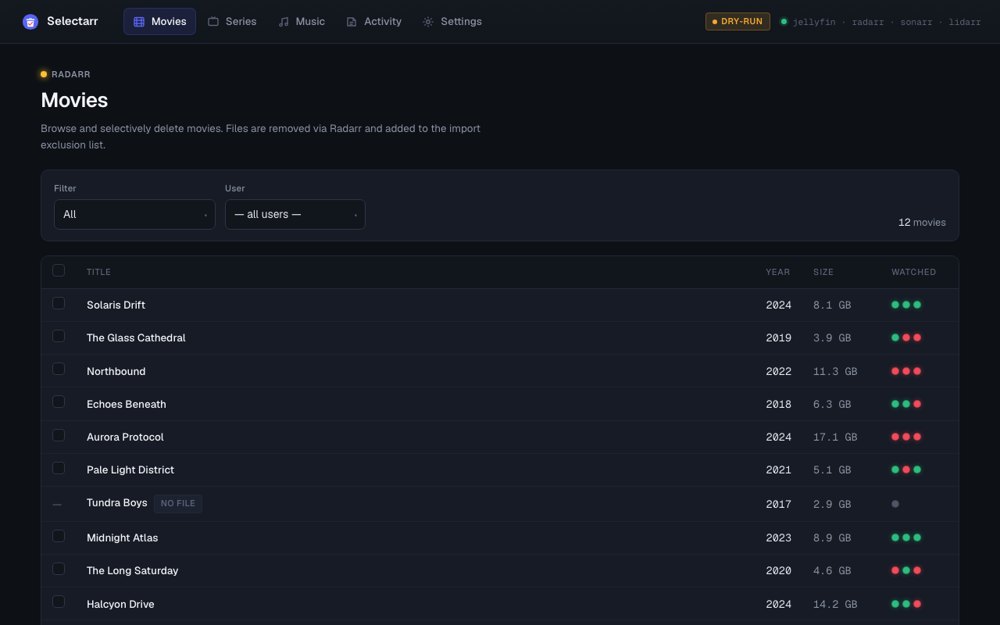

# Installing Selectarr

Get Selectarr running in under 10 minutes. Choose one method:

- **[Docker](#docker-recommended)** — recommended, no Python knowledge required
- **[Local Python](#local-python-development)** — for development or systems without Docker

---

## Docker (recommended)

### Prerequisites

**Docker Desktop** (includes Docker Compose)  
Download from https://www.docker.com/products/docker-desktop — available for Mac, Windows, and Linux.  
After installing, open a terminal and verify it works:

```
docker --version
docker compose version
```

Both commands should print a version number. If you see "command not found", Docker is not installed correctly.

---

### Step 1 — Download the compose file

```bash
curl -O https://raw.githubusercontent.com/xanderburchartz/selectarr/main/docker-compose.yml
```

Or [download it manually](https://github.com/xanderburchartz/selectarr/blob/main/docker-compose.yml) and place it in a new folder called `selectarr`.

---

### Step 2 — Create the config directory

```bash
mkdir -p config
```

That's all — no need to edit any files manually. Selectarr will write its configuration on first run.

---

### Step 3 — Start the container

```bash
docker compose up -d
```

Docker pulls the pre-built image from `ghcr.io/xanderburchartz/selectarr:latest` and starts the container in the background. The first run takes about 15–30 seconds while it downloads the image.

To watch the startup logs:

```bash
docker compose logs -f selectarr
```

You should see:

```
INFO:     Uvicorn running on http://0.0.0.0:8889 (Press CTRL+C to quit)
```

---

### Step 4 — Configure through the Settings page

Open **http://localhost:8889** in your browser. Selectarr will redirect you to the **Settings** page automatically on first run.

**Auto-discovery** — if you mount your Radarr, Sonarr, and Lidarr config directories into the container (see below), Selectarr reads their `config.xml` files on first open and pre-fills the URL and API key fields for you. Each service card shows an **Auto-discovered** badge when this succeeds. Jellyfin cannot be auto-discovered and always requires manual entry.

To enable auto-discovery, add these volume mounts to `docker-compose.yml` before starting the container, replacing the paths with the actual locations on your host:

```yaml
volumes:
  - ./config:/config
  - /path/to/radarr/config:/arr/radarr:ro
  - /path/to/sonarr/config:/arr/sonarr:ro
  - /path/to/lidarr/config:/arr/lidarr:ro
```

Without the mounts, fill in the URL and API key for each service manually:

| Service | Default URL | Where to find the API key |
|---------|-------------|--------------------------|
| **Jellyfin** (required) | `http://your-server:8096` | Dashboard → API Keys → click **+** |
| **Radarr** (optional) | `http://your-server:7878` | Settings → General → Security → API Key |
| **Sonarr** (optional) | `http://your-server:8989` | Settings → General → Security → API Key |
| **Lidarr** (optional) | `http://your-server:8686` | Settings → General → Security → API Key |

After entering the URL and API key for a service, click **Test connection**. Selectarr will reach out to the service immediately and show a green "Connected" badge if it can reach it. Fix any red badges before continuing.

> Radarr, Sonarr, and Lidarr are optional — leave both fields empty to disable that tab entirely.

Once everything is green, click **Save settings**. Selectarr writes `config/config.yaml` for you and redirects to the login page.

---

### Step 5 — Log in

Sign in with your **Jellyfin** username and password. Selectarr uses Jellyfin for authentication — there are no separate Selectarr accounts.

---

### Stopping and starting

```bash
docker compose stop        # pause the container
docker compose start       # resume it
docker compose down        # stop and remove the container
docker compose up -d       # start fresh
```

Your `config/` directory is mounted as a volume, so your settings and activity log survive `docker compose down`.

---

## Local Python (development)

### Prerequisites

**Python 3.11 or newer**

Check your version:

```bash
python3 --version
```

If you see `Python 3.11.x` or higher, you're ready. If not, download Python from https://www.python.org/downloads — use the latest 3.11.x or 3.12.x release.

---

### Step 1 — Download Selectarr

```bash
git clone https://github.com/xanderburchartz/selectarr.git
cd selectarr
```

---

### Step 2 — Create a virtual environment

A virtual environment keeps Selectarr's dependencies isolated from your system Python:

```bash
python3 -m venv venv
source venv/bin/activate    # Mac / Linux
venv\Scripts\activate       # Windows
```

Your terminal prompt will change to show `(venv)` when the environment is active.

---

### Step 3 — Install dependencies

```bash
pip install -r requirements.txt
```

This installs FastAPI, Uvicorn, and everything else Selectarr needs. It takes about 30 seconds.

---

### Step 4 — Create the config directory

```bash
mkdir -p config
```

No need to edit any files — the Settings page handles this.

---

### Step 5 — Start the app

```bash
uvicorn app.main:app --reload --port 8889
```

Open **http://localhost:8889** and configure your services through the Settings page (same as [Step 4 in the Docker guide](#step-4--configure-through-the-settings-page) above).

Press **Ctrl+C** in the terminal to stop the server.

---

## What gets written to config.yaml

When you save through the Settings page, Selectarr writes a `config/config.yaml` file that looks like this:

```yaml
jellyfin:
  url: "http://192.168.1.10:8096"   # Base URL of your Jellyfin server
  api_key: "abc123..."              # Jellyfin API key

radarr:
  url: "http://192.168.1.10:7878"   # Only present if you filled in Radarr
  api_key: "abc123..."

sonarr:
  url: "http://192.168.1.10:8989"   # Only present if you filled in Sonarr
  api_key: "abc123..."

lidarr:
  url: "http://192.168.1.10:8686"   # Only present if you filled in Lidarr
  api_key: "abc123..."

dry_run: true                        # true = simulate deletions (no files touched)
add_import_exclusion: true           # prevent deleted items from being re-downloaded
configured: true                     # written automatically; do not remove
```

You can edit this file by hand at any time — just restart the container afterwards. Or re-open Settings and change values there; the Test connection buttons work on whatever you've typed, before you hit Save.

> **`configured: true`** is what tells Selectarr you've intentionally set up real credentials. If you copy `config.yaml.example` and edit it by hand, you need to add this line yourself, or open Settings and click Save once to have it added automatically.

---

## Docker networking

If Selectarr and your \*arr services all run in Docker on the same host, container hostnames (like `jellyfin`, `radarr`) won't resolve unless they share a Docker network. Two options:

**Option A — Use your host's LAN IP** (simplest)

Enter your machine's local IP address in the URL fields, e.g. `http://192.168.1.10:8096`. Works regardless of Docker networking.

**Option B — Shared Docker network** (keeps traffic inside Docker)

Uncomment the `networks` block in `docker-compose.yml`:

```yaml
networks:
  arr-net:
    external: true
```

Set `arr-net` to the network name your \*arr stack uses, then you can use container service names as hostnames in the URL fields.

---

## What you'll see



The left sidebar has five items:

- **Home** — library overview with total counts and sizes per service
- **Movies** — browse downloaded movies; filter by watch status; select and delete
- **Series** — expandable tree of series → seasons → episodes with per-level deletion
- **Music** — expandable tree of artists → albums → tracks

> **Dry-run mode is on by default.** The delete button reads "Simulate" until you turn off dry-run in Settings. This lets you preview exactly what would be removed before anything is actually deleted.

---

## Troubleshooting

**The app redirects me to Settings every time I open it.**  
Your config doesn't have `configured: true`. Open Settings and click **Save settings** once — that stamps it automatically.

**The Test connection button shows red.**  
The URL is wrong or unreachable from where Selectarr is running. Double-check the IP/hostname and port. If running in Docker, see [Docker networking](#docker-networking) above.

**Port 8889 is already in use.**  
Edit `docker-compose.yml` and change the left side of the port mapping:
```yaml
ports:
  - "9000:8889"   # now accessible at http://localhost:9000
```

**I want real deletions, not simulations.**  
Open Settings and toggle **Dry-run mode** off, then click **Save settings**.

**How do I update to a newer version?**

```bash
docker compose pull
docker compose up -d
```
